# LeapMotionPointer
Leap Motionでクリック操作をするためのUnity用のスクリプトです。


# 前提
動作確認をしたのは以下の環境です。

- Windows10
- Unity2017.4.20と2018.3.2
- Leap Motion Orion 4.0.0
- Unity Core Assets 4.4.0

## WebGLについて
Unity2017.4ではビルドできませんでした。Unity2018.1にして、Unsafe Codeを許可するとビルドはできましたが、実行時にエラーが出て動きませんでした。WebGLでの動かし方は分かっていません。

# 環境設定
Leap MotionをUnityで使えるようにする手順はこちらの[公式ページ](https://developer.leapmotion.com/windows-vr)で説明されています。すでに環境を構築済みでしたら、飛ばして構いません。

- [公式ページ](https://developer.leapmotion.com/windows-vr)を開きます
- *DOWNLOAD ORION BETA*のボタンをクリックして、Leap Motion Orionの最新版をダウンロードしてインストールします
- [公式のこちら](https://developer.leapmotion.com/unity/#5436356)を開きます
- *DOWNLOAD UNITY CORE ASSETS X.X.X*のボタンをクリックして、アセットをダウンロードします

以上で下準備完了です。

# デモを動かす
デモの実行方法です。

- 本リポジトリーをクローンするか、ZIPダウンロードします
- Unity2017.4以降でクローンしたフォルダーを開きます

Leap Motion用のアセットがないので、以下のようなエラーが出ます。次の手順で消えますので作業を進めてください。

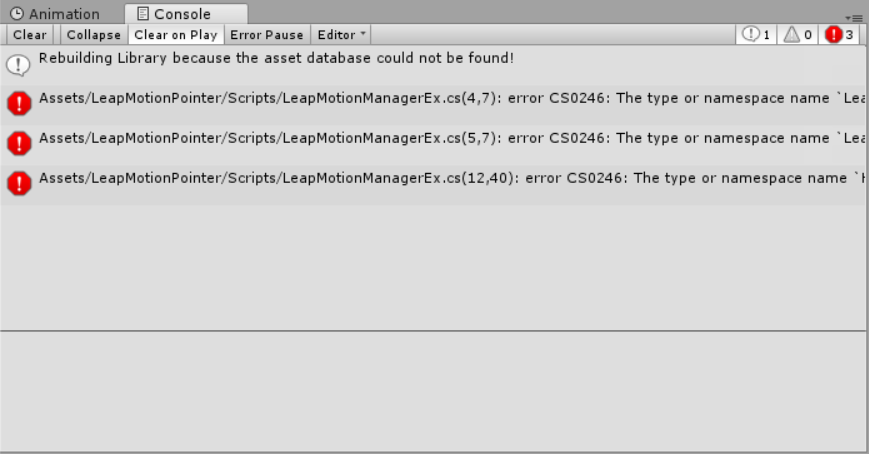

- 上の手順でダウンロードした**Unity Core Assets**をプロジェクトにインポートします


これでエラーが消えます。

- *Project*ウィンドウから、*LeapMotionPointer* > *Demo*フォルダーを開いて、*Demo*シーンをダブルクリックして開きます

以上でデモ用のシーンが開きます。*Play*するとデモが動きます。

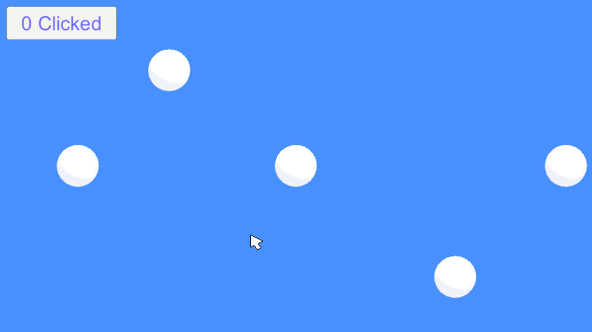

## 操作方法
手を水平に開いておくのが基本姿勢です。以下のように、Leap Motionの上に手を開いて、水平にかざします。

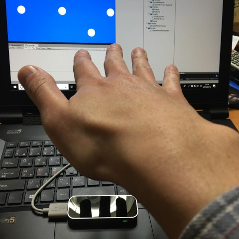

手のひらを水平にしたまま、上下左右に手を動かして画面にカーソルが表示される場所を探してください。Leap Motionから少し奥で、30cmぐらい上の位置ぐらいで表示されると思います。

**左手でも操作できます。**

### 左右移動
手を左右に動かします。

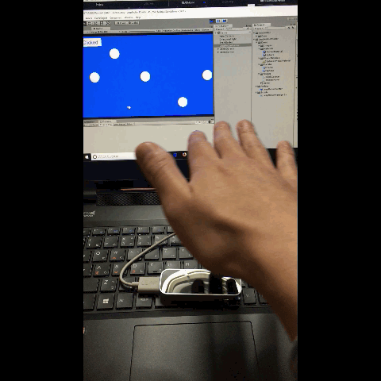

### 上下移動
手を上下、あるいは前後に動かします。

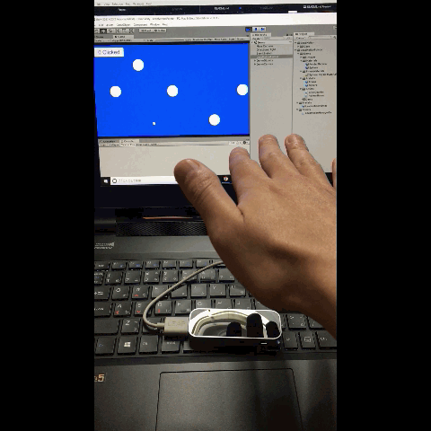

上下、前後のどちらも、カーソルは上下移動と見なします。

### クリック
クリックは、人差し指を下げます。

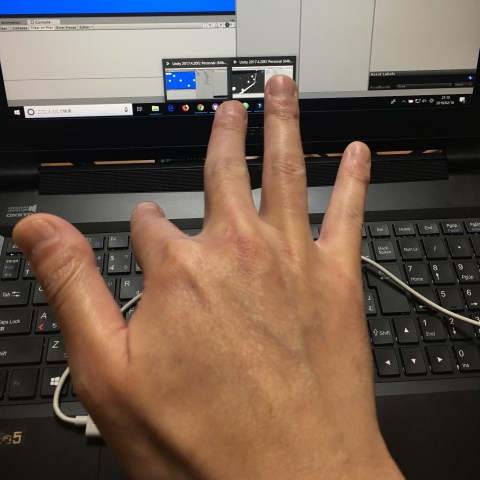

**人差し指**と**薬指**の高さの違いでクリック判定をしています。中指は見ていないので、曲げても曲げなくてもどちらでも楽な方で。

手のひらが左に傾いていると誤クリックが増えます。

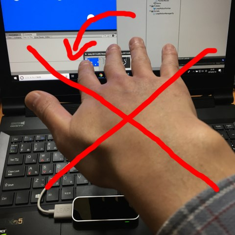

少し右に傾けておく方が操作しやすいです。

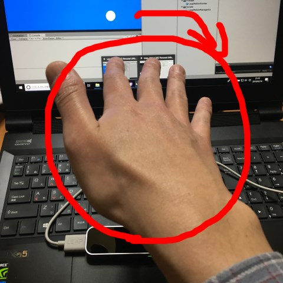

丸いのをドラッグしたり、左上のボタンをクリックしたりしてみてください。


手のひらを右に傾けておけば、適当に操作してもそれっぽく動きます。

手の認識がうまくいっていないと動作が不安定になります。反対側に動いたり、震えたりする場合は、手をLeap Motionの視野から一旦外してから、手を認識しなおしてください。

# プロジェクトに組み込む
組み込みたいプロジェクトをUnity2017.4以降で開いてから、以下の作業をします。

## 必要なアセットをインポート
- ダウンロードしてあるUnity Core Assets(`Leap_Motion_Core_Assets_ x.x.x.unitypackage`)をインポートします
- [このリポジトリーのReleases](https://github.com/am1tanaka/LeapMotionPointer/releases)を開いて、最新版の`LeapMotionPointerX.X.X.unitypackage`をダウンロードして、プロジェクトにインポートします
- LeapMotionを使いたいシーンを開きます
- *Project*ウィンドウで、*LeapMotionPointer* > *Prefabs*フォルダーを開きます
- *LeapMotionPointer*プレハブをドラッグして、*Hierarchy*ウィンドウにドロップします

これで準備完了です。ついでに、動作確認のためにデモ用のCanvasを配置しておくと楽です。

- *Project*ウィンドウの*LeapMotionPointer* > *Demo* > *Prefabs*フォルダーを開いて、*DemoCanvas*プレハブを*Hierarchy*ウィンドウにドロップします
- *EventSystem*がシーンにない場合は、*Hierarchy*ウィンドウの*Create*ボタンをクリックして、*UI* > *Event System*を選択して追加します

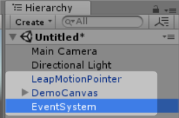

これでLeapMotionを使ってカーソルを操作できます。カーソルは、*DemoCanavs*の子供の*Cursor*オブジェクトです。これの画像を差し替えればオリジナルのものに差し替えることができます。

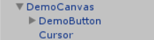

## スクリプトで情報を得る
情報は、`LeapMotionManagerEx`クラスの`static`プロパティーでします。

利用したいスクリプトの冒頭に、以下の`using`を追加します。

```cs
using AM1.LeapMotionPointer;
```

### `bool LeapMotionManagerEx.isEnable`
Leap Motionで手を確認している時に`true`になります。

### `Vector3 LeapMotionManagerEx.screenPoint`
Leap Motionが指している画面座標を返します。Zは無効です。

#### 例

```cs
Debug.Log(LeapMotionManagerEx.screenPoint);
```

#### 補足

カメラはデフォルトでは、`Camera.main`で取得できるカメラを利用します。*Main Camera*タグが未設定だった場合など、`Camera.main`が取得できない状態の時は、`screenPoint`は無効な値を返します。

カメラを指定するには、シーンに配置した*LeapMotionPointer*オブジェクトの*Target Camera*プロパティーに目的のカメラを設定します。

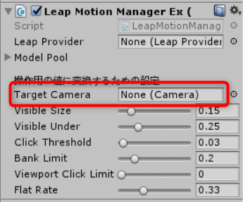

### `Vector3 LeapMotionManagerEx.viewportPosition`

Leap Motionが指している場所をビューポート座標で返します。

### `bool LeapMotionManagerEx.isPressDown`

クリックを開始した時に`true`になります。

#### 例

```cs
if (LeapMotionManagerEx.isPressDown) {
    Debug.Log("クリック!");
}
```

### `bool LeapMotionManagerEx.isPress`

クリック状態の時、ずっと`true`になります。ドラッグを判定したい場合などに利用します。

#### 例

```cs
if (LeapMotionManagerEx.isPress) {
    Debug.Log("押し続けている");
}
```

### `bool LeapMotionManagerEx.isPressUp`
クリックが解除された時に`true`になります。

#### 例

```cs
if (LeapMotionManagerEx.isPressUp) {
    Debug.Log("クリック終了");
}
```

## UIのボタン
UIのボタンは、クリック時に自動的に押すようにしてあります。何もしなくても反応します。


# パラメーター
*LeapMotionPointer*動作についての調整パラメーターです。

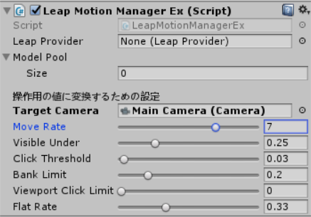

- *Leap Provider*
  - Leap Motionを制御しているインスタンスです。自動的に設定されるので、設定不要です
- *Model Pool*
  - 手のモデルを表示したい時に利用します。本プロジェクトでは設定不要です
- *Target Camera*
  - `LeapMotionManagerEx.screenPoint`を計算する時に使うカメラを指定します。未設定の時は、`Camera.main`の値を使います。`Camera.main`が`null`の時は、`LeapMotionManagerEx.screenPoint`の値が設定されません
- *Move Rate*
  - 手の動きと、カーソルの動きを対応させる係数です。この値を大きくすると、手の動きに対して、カーソルの動きが速くなります
- *Visible Under*
  - 手の低さの下限値です。この値を小さくすると、低い位置で手を認識するようになります。小さくしすぎると指の動きが認識できなくなるので、`0.15`程度が下限です
- *Click Threshold*
  - クリックを判別する人差し指と薬指の高さの差です。この値を大きくすると、クリックの誤動作は減りますが、クリックの反応が鈍くなります
- *Bank Limit*
  - 手首の傾きがこの値よりも大きくなったら、誤動作を避けるためにクリック判定を無視します。`0`は傾き無し。`0.5`が90度です
- *Viewport Click Limit*
  - 画面端でクリックを無視する範囲です。特に不要な場合は`0`のままで構いません
- *Flat Rate*
  - 手の震えを止めるための平均係数です。この値を小さくすると反応はよくなりますが、Leap Motionの誤差による震えが出やすくなります

# 今後について
現在、UIのボタンは無理やり`Button`コンポーネントを取得して、クリック時のイベントを実行するようにしています。レイヤーの指定などができず、他の要素のクリックもできないので、将来的には*Event System*に対応させることを考えています。

プルリク歓迎です。


# ライセンス
[MITライセンス](LICENSE)


# 参考URL
- [LeapMotionの公式ページ](https://www.leapmotion.com/ja/)
